# SimpleJSON

A lightweight JSON library written in **modern C++ (C++17)** that provides:

* JSON parsing
* JSON serialization
* Programmatic JSON construction
* A simple CLI query tool (similar to a minimal `jq`)

The goal of this project is to demonstrate how a JSON library can be implemented **from scratch** using modern C++ features such as `std::variant`, while keeping the design **clean and easy to understand**.

This project is intended as a **learning project and portfolio piece**, showcasing C++ design, parsing logic, and library structure.

---

# Features

* JSON parsing
* JSON serialization
* Pretty printed JSON output
* JSON object and array support
* JSON value manipulation
* Simple query CLI tool
* Minimal dependencies
* Clean modular architecture

Supported JSON types:

* `null`
* `int`
* `double`
* `bool`
* `string`
* `object`
* `array`

---

# Project Structure

```
json_parser_cpp_library/
│
├── include/
│   ├── json_value.hpp
│   ├── json_parser.hpp
│   ├── json_serializer.hpp
│   └── simple_json.hpp
│
├── src/
│   ├── json_parser.cpp
│   ├── json_serializer.cpp
│   └── simple_json.cpp
│
├── tools/
│   └── jcli.cpp
│
├── tests/
│   └── test_json.cpp
│
├── build/
│
├── Makefile
└── README.md
```

---

# Requirements

This project only requires a **modern C++ compiler** and **make**.

Minimum requirements:

* C++17 compatible compiler
* GNU Make

Recommended environment:

* Linux (Ubuntu, Debian, Fedora, etc.)
* macOS
* WSL (Windows Subsystem for Linux)

---

# Installing Required Tools

## Ubuntu / Debian

```
sudo apt update
sudo apt install build-essential
```

This installs:

* `g++`
* `make`
* standard C++ libraries

---

## Arch Linux

```
sudo pacman -S base-devel
```

---

## Fedora

```
sudo dnf install gcc-c++ make
```

---

## macOS

Install Xcode Command Line Tools:

```
xcode-select --install
```

---

# Building the Project

Clone the repository:

```
git clone https://github.com/ma7moud111/json_parser_cpp_library.git
cd json_parser_cpp_library
```

Compile the project:

```
make
```

Build artifacts will appear inside the **build/** directory.

---

# Cleaning Build Files

```
make clean
```

---

# Running Tests

After building:

```
./build/test_json
```

This runs the example tests demonstrating:

* JSON creation
* JSON serialization
* JSON parsing

---

# Example Usage (Library)

## Building JSON Programmatically

```cpp
CJsonValue json;

json["name"] = "Mahmoud";
json["age"] = 24;

json["skills"][0] = "C++";
json["skills"][1] = "Linux";

json["active"] = true;

CSimpleJson sj;

std::cout << sj.write_str(json) << std::endl;
```

Output:

```
{
  "name": "Mahmoud",
  "age": 24,
  "skills": [
    "C++",
    "Linux"
  ],
  "active": true
}
```

---

## Parsing JSON

```cpp
std::string text = R"(
{
    "name": "Mahmoud",
    "age": 24,
    "skills": ["C++","Linux"]
}
)";

CSimpleJson sj;

auto result = sj.read_str(text);

if (result)
{
    CJsonValue json = *result;
    std::cout << sj.write_str(json) << std::endl;
}
```

---

## Reading JSON From a File
You can parse JSON directly from a file using ```read_file```.

Example file ```data.json```

```json
{
  "name": "Mahmoud",
  "age": 24,
  "skills": ["C++", "Linux"]
}
```

```cpp
#include <iostream>
#include "simple_json.hpp"

int main()
{
    CSimpleJson sj;

    auto result = sj.read_file("data.json");

    if (!result)
    {
        std::cout << "Failed to read JSON file" << std::endl;
        return 1;
    }

    CJsonValue json = *result;

    std::cout << sj.write_str(json) << std::endl;

    return 0;
}
```

---


---

## Writing JSON to a File
You can create JSON programmatically and save it to a file using ```write_file```.


```cpp
#include <iostream>
#include "simple_json.hpp"

int main()
{
    CSimpleJson sj;

    CJsonValue json;

    json["project"] = "SimpleJSON";
    json["version"] = 1;

    if (sj.write_file(json, "output.json"))
    {
        std::cout << "JSON written successfully" << std::endl;
    }
    else
    {
        std::cout << "Failed to write JSON file" << std::endl;
    }

    return 0;
}
```

Generated file ```output.json```

```json
{
  "project": "SimpleJSON",
  "version": 1
}
```

---


# Command Line Tool

A minimal CLI tool is provided to demonstrate querying JSON files.

Build the CLI:

```
make jcli
```

Run:

```
./build/jcli file.json query
```

---

## Architecture UML

The following diagram shows the architecture of the JSON library.

```mermaid
classDiagram

class CJsonValue {
  variant m_value
  +is_null()
  +is_object()
  +is_array()
  +is_string()
  +is_number()
  +is_bool()
  +operator[](string)
  +operator[](size_t)
}

class CJsonParser {
  string m_text
  size_t m_pos
  +parse()
  -parse_value()
  -parse_object()
  -parse_array()
  -parse_string()
  -parse_number()
  -parse_bool()
}

class CJsonSerializer {
  +serialize(value)
  -serialize_object(value)
  -serialize_array(value)
}

class CSimpleJson {
  +read_str(text)
  +write_str(value)
  +read_file(path)
  +write_file(value, path)
  +is_valid(text)
}

class jcli {
  +main(argc, argv)
}

CSimpleJson ..> CJsonParser
CSimpleJson ..> CJsonSerializer
CJsonParser ..> CJsonValue
CJsonSerializer ..> CJsonValue
jcli ..> CSimpleJson
```



## Example JSON

`data.json`

```
{
  "name": "Mahmoud",
  "age": 24,
  "skills": ["C++","Linux"]
}
```

---

## Query Examples

Get value:

```
./build/jcli data.json name
```

Output

```
"Mahmoud"
```

---

Get array element:

```
./build/jcli data.json skills.0
```

Output

```
"C++"
```

---

Get entire object:

```
./build/jcli data.json skills
```

Output

```
[
  "C++",
  "Linux"
]
```

Query syntax supports:

```
key
key.key
key.index
key.key.index
```

Example:

```
user.address.city
skills.1
```

This is intentionally **very simple** and serves only as a demonstration tool.

---

# Implementation Details

The library is composed of several core components.

---

## CJsonValue

Represents a JSON value using `std::variant`.

```
std::variant<
    std::nullptr_t,
    int,
    double,
    bool,
    std::string,
    JsonObject,
    JsonArray
>
```

This allows safe storage of different JSON types.

---

## CJsonParser

Responsible for converting JSON text into a `CJsonValue`.

Parsing functions include:

* `parse_object()`
* `parse_array()`
* `parse_string()`
* `parse_number()`
* `parse_bool()`

The parser works by iterating through the input text character by character.

---

## CJsonSerializer

Responsible for converting `CJsonValue` objects into JSON text.

Features:

* pretty printed output
* indentation
* recursive serialization

---

## CSimpleJson

Provides the **public API** for the library.

```
std::optional<CJsonValue> read_str(const std::string& text)
std::string write_str(const CJsonValue& value)
std::optional<CJsonValue> read_file(const std::string& path)
bool write_file(const CJsonValue& value, const std::string& path)
bool is_valid(const std::string& text)
```

This separates the **internal implementation** from the **public interface**.

---

# Design Goals

This project focuses on:

* simplicity
* readability
* minimal dependencies
* modern C++ practices

It avoids heavy abstractions to keep the code understandable.

---

# Limitations

This project intentionally keeps the implementation simple.

Not implemented:

* full JSON specification edge cases
* advanced error recovery
* escape sequence handling
* full jq query language

The CLI tool is intentionally **minimal**.

---

# License

This project is open source and intended for educational use.
